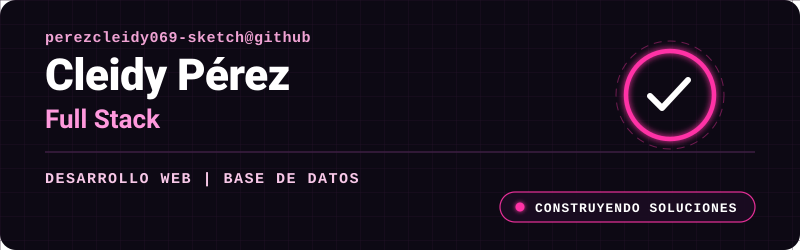

<p align="center">
  
</p>

<br />

<h1 align="center">Hola, soy Cleidy Pérez</h1>

<p align="center">
  <strong>Full-Stack | Base de datos </strong>
  <br />
  Apasionada por el desarrollo web frontend, backend y el diseño de bases de datos. En constante aprendizaje y construyendo proyectos con código limpio y eficiente.
</p>

<div align="center">
  <a href="https://github.com/perezcleidy069-sketch">
    
  </a>
</div>

---

<h2>Qué hago</h2>

<table>
  <tr>
    <td width="50%">
      <h3>Desarrollo Web Frontend</h3>
      <p>Diseño y creo interfaces web limpias, interactivas y adaptables a cualquier dispositivo utilizando <strong>HTML5, CSS3 y JavaScript</strong>.</p>
    </td>
    <td width="50%">
      <h3>Bases de Datos & SQL</h3>
      <p>Diseño esquemas de bases de datos relacionales, creo tablas y optimizo consultas para gestionar información con <strong>MySQL</strong>.</p>
    </td>
  </tr>
  <tr>
    <td width="50%">
      <h3>Automatización con n8n</h3>
      <p>Conecto servicios, herramientas y APIs para automatizar tareas repetitivas y flujos de trabajo de forma eficiente mediante <strong>n8n</strong>.</p>
    </td>
    <td width="50%">
      <h3>Lógica Backend Básica</h3>
      <p>Integración de scripts en JavaScript para conectar el frontend con bases de datos y procesar datos del usuario.</p>
    </td>
  </tr>
</table>

---

## Stack principal

<div align="center">
  
</div>

<br />

<div align="center">
  
  
  
  
</div>

---

## Areas de experiencia

<h2>Áreas de enfoque</h2>

<table>
  <tr>
    <td width="33%" valign="top">
      <h3>Desarrollo Frontend</h3>
      <ul>
        <li>Maquetación estructurada con <strong>HTML5</strong></li>
        <li>Estilos, diseño adaptativo y layouts con <strong>CSS3</strong></li>
        <li>Lógica web e interacción con <strong>JavaScript </strong></li>
        <li>Manipulación del DOM y diseño responsive</li>
      </ul>
    </td>
    <td width="33%" valign="top">
      <h3>Bases de Datos & n8n</h3>
      <ul>
        <li>Diseño de modelos relacionales con <strong>MySQL</strong></li>
        <li>Consultas SQL (SELECT, INSERT, UPDATE, JOINs)</li>
        <li>Automatización de flujos con <strong>n8n</strong></li>
        <li>Conexión de servicios e integración de APIs</li>
      </ul>
    </td>
    <td width="33%" valign="top">
      <h3>Herramientas & Metodologías</h3>
      <ul>
        <li>Entorno de desarrollo en <strong>VS Code</strong></li>
        <li>Control de versiones con <strong>Git & GitHub</strong></li>
        <li>Uso de buenas prácticas de código limpio</li>
        <li>Constante aprendizaje y resolución de problemas</li>
      </ul>
    </td>
  </tr>
</table>

---

## Asesorias y conferencias

Trabajo con empresas y equipos que necesitan convertir problemas operativos en soluciones tecnicas claras.

- Asesoria en desarrollo de software y arquitectura de sistemas.
- Evaluacion y mejora de aplicaciones existentes.
- Asesoria sobre sistemas de terceros, integraciones y adopcion tecnologica.
- Conferencias sobre soluciones digitales, automatizacion, cloud, seguridad y modernizacion empresarial.
- Acompanamiento en venta, configuracion y puesta en marcha de cloud services.
- Montaje de aplicaciones, infraestructura de red, dominios, DNS y ambientes productivos.

---

## Proyectos educativos

<table>
  <tr>
    <td width="50%">
      <h3>Campuslands Devs</h3>
      <p>Creo repositorios educativos por niveles para que estudiantes aprendan logica, Git, JavaScript, TypeScript, PHP, SQL, MongoDB, Node.js, Express y buenas practicas de desarrollo con ejercicios progresivos.</p>
    </td>
    <td width="50%">
      <h3>Mentoria practica</h3>
      <p>Me enfoco en que los estudiantes aprendan haciendo: estructura real de proyectos, flujo profesional con ramas, Pull Requests, feedback y revision tecnica.</p>
    </td>
  </tr>
</table>

## Actividad en vivo

<div align="center">
  
  
</div>

<div align="center">
  
</div>

<div align="center">
  
</div>

---

## Tarjetas automaticas

<div align="center">
  
  
  
  
  
</div>

---

## Como trabajo

```txt
Problema -> diagnostico -> arquitectura -> desarrollo -> despliegue -> seguridad -> mejora continua
```

<table>
  <tr>
    <td>Arquitectura simple</td>
    <td>Prefiero sistemas faciles de mantener, con estructura limpia y decisiones tecnicas justificadas.</td>
  </tr>
  <tr>
    <td>Entrega real</td>
    <td>No solo construyo pantallas: conecto APIs, bases de datos, dominios, cloud, redes, seguridad, despliegues y automatizaciones.</td>
  </tr>
  <tr>
    <td>Vision empresarial</td>
    <td>Analizo tecnologia desde el impacto en ventas, operacion, costos, seguridad, continuidad y crecimiento.</td>
  </tr>
  <tr>
    <td>Mejora continua</td>
    <td>Actualizo procesos, documento soluciones y convierto problemas repetidos en herramientas reutilizables.</td>
  </tr>
</table>

---

## Contacto

<div align="center">
  <a href="https://alcore-gt.com/">
    
  </a>
  <a href="https://github.com/anndreloopez012">
    
  </a>
</div>

<br />

<div align="center">
  <strong>Disponible para desarrollo de software, consultoria tecnica, cloud services, infraestructura, seguridad y soluciones digitales para empresas.</strong>
</div>
